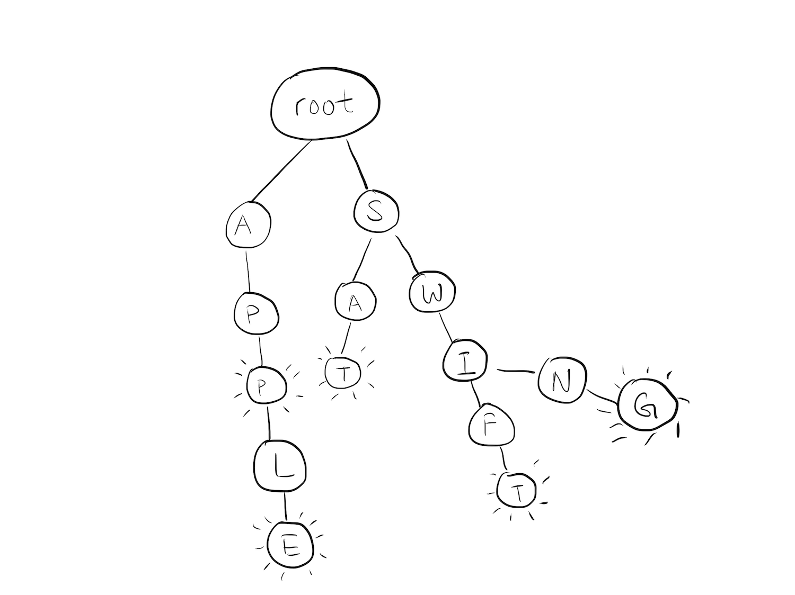

# Trie

> This topic has been tutorialized [here](https://www.raywenderlich.com/139410/swift-algorithm-club-swift-trie-data-structure)

## What is a Trie?

A `Trie`, (also known as a prefix tree, or radix tree in some other implementations) is a special type of tree used to store associative data structures. A `Trie` for a dictionary might look like this:



Storing the English language is a primary use case for a `Trie`. Each node in the `Trie` would represent a single character of a word. A series of nodes then make up a word.

## Why a Trie?

Tries are very useful for certain situations. Here are some of the advantages:

* Looking up values typically have a better worst-case time complexity.
* Unlike a hash map, a `Trie` does not need to worry about key collisions.
* Doesn't utilize hashing to guarantee a unique path to elements.
* `Trie` structures can be alphabetically ordered by default.

## Common Algorithms

### Contains (or any general lookup method)

`Trie` structures are great for lookup operations. For `Trie` structures that model the English language, finding a particular word is a matter of a few pointer traversals:

```swift
func contains(word: String) -> Bool {
	guard !word.isEmpty else { return false }

	// 1
	var currentNode = root
  
	// 2
	var characters = Array(word.lowercased().characters)
	var currentIndex = 0
 
	// 3
	while currentIndex < characters.count, 
	  let child = currentNode.children[characters[currentIndex]] {

	  currentNode = child
	  currentIndex += 1
	}

	// 4
	if currentIndex == characters.count && currentNode.isTerminating {
	  return true
	} else {
	  return false
	}
}
```

The `contains` method is fairly straightforward:

1. Create a reference to the `root`. This reference will allow you to walk down a chain of nodes.
2. Keep track of the characters of the word you're trying to match.
3. Walk the pointer down the nodes.
4. `isTerminating` is a boolean flag for whether or not this node is the end of a word. If this `if` condition is satisfied, it means you are able to find the word in the `trie`.

### Insertion

Insertion into a `Trie` requires you to walk over the nodes until you either halt on a node that must be marked as `terminating`, or reach a point where you need to add extra nodes.

```swift
func insert(word: String) {
  guard !word.isEmpty else {
    return
  }

  // 1
  var currentNode = root

  // 2
  for character in word.lowercased().characters {
    // 3
    if let childNode = currentNode.children[character] {
      currentNode = childNode
    } else {
      currentNode.add(value: character)
      currentNode = currentNode.children[character]!
    }
  }
  // Word already present?
  guard !currentNode.isTerminating else {
    return
  }

  // 4
  wordCount += 1
  currentNode.isTerminating = true
}
```

1. Once again, you create a reference to the root node. You'll move this reference down a chain of nodes.
2. Begin walking through your word letter by letter
3. Sometimes, the required node to insert already exists. That is the case for two words inside the `Trie` that shares letters (i.e "Apple", "App"). If a letter already exists, you'll reuse it, and simply traverse deeper down the chain. Otherwise, you'll create a new node representing the letter.
4. Once you get to the end, you mark `isTerminating` to true to mark that specific node as the end of a word.

### Removal

Removing keys from the trie is a little tricky, as there are a few more cases you'll need to take into account. Nodes in a `Trie` may be shared between different words. Consider the two words "Apple" and "App". Inside a `Trie`, the chain of nodes representing "App" is shared with "Apple". 

If you'd like to remove "Apple", you'll need to take care to leave the "App" chain in tact.

```swift
func remove(word: String) {
  guard !word.isEmpty else {
    return
  }

  // 1
  guard let terminalNode = findTerminalNodeOf(word: word) else {
    return
  }

  // 2
  if terminalNode.isLeaf {
    deleteNodesForWordEndingWith(terminalNode: terminalNode)
  } else {
    terminalNode.isTerminating = false
  }
  wordCount -= 1
}
```

1. `findTerminalNodeOf` traverses through the Trie to find the last node that represents the `word`. If it is unable to traverse through the chain of characters, it returns `nil`.
2. `deleteNodesForWordEndingWith` traverse backwords, deleting the nodes represented by the `word`.

### Time Complexity

Let n be the length of some value in the `Trie`.

* `contains` - Worst case O(n)
* `insert` - O(n)
* `remove` - O(n)

### Other Notable Operations

* `count`: Returns the number of keys in the `Trie` - O(1)
* `words`: Returns a list containing all the keys in the `Trie` - O(1)
* `isEmpty`: Returns `true` if the `Trie` is empty, `false` otherwise - O(1)

See also [Wikipedia entry for Trie](https://en.wikipedia.org/wiki/Trie).

*Written for the Swift Algorithm Club by Christian Encarnacion. Refactored by Kelvin Lau*

# Changes by Rick Zaccone

* Added comments to all methods
* Refactored the `remove` method
* Renamed some variables.  I have mixed feelings about the way Swift infers types.  It's not always apparent what type a variable will have.  To address this, I made changes such as renaming `parent` to `parentNode` to emphasize that it is a node and not the value contained within the node.
* Added a `words` property that recursively traverses the trie and constructs an array containing all of the words in the trie.
* Added a `isLeaf` property to `TrieNode` for readability.
* Implemented `count` and `isEmpty` properties for the trie.
* I tried stress testing the trie by adding 162,825 words.  The playground was very slow while adding the words and eventually crashed.  To fix this problem, I moved everything into a project and wrote `XCTest` tests that test the trie.  There are also several performance tests.  Everything passes.
